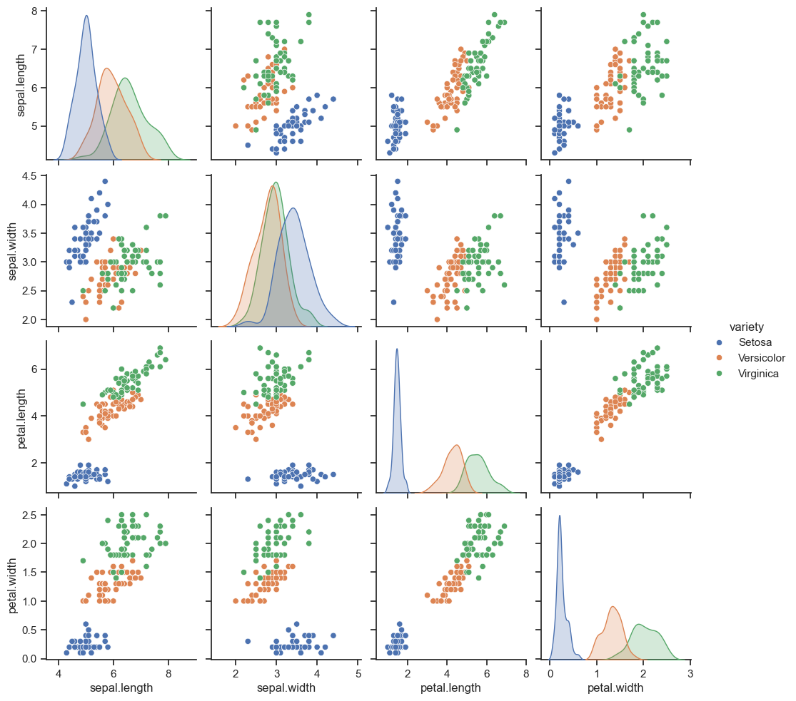

# Machine Learning project
In this project, I am attempting to create a machine learning model capable of recognizing different types of iris flowers based on their sepal and petal lengths and widths.

## Dataset
The Iris dataset was download from the [Github](https://gist.github.com/netj/8836201) website. 

This database contains information about various attributes of iris flowers, such as the length and width of sepals and petals, along with the corresponding iris species based on these attributes.

The database have 150 rows and 5 columns.

## Data Analysis

From the above plot, we can observe that the length and width of the petal are correlated, and for each species, we are able to create a separate cluster. For the sepal, a similar situation is observed, although it is less clear, but similar. Taking into account these four values, I believe we can create a model that will be able to recognize the appropriate type of iris based on these values.

## Machine learning model
* At first, I split the column "variety" because this value is what the machine learning model will try to predict. 

* Next the data is divided into training and testing sets in proportions of 80% to 20%.

* I load the data into the machine learning model. In this case I used Decision Tree Classifier

* Finally, we check the level of prediction accuracy.
```py
# Import library to split data
from sklearn.model_selection import train_test_split

# Split column "Variety"
y = iris.pop("variety")
y = list(y)
iris.head()

# Split random data for training and testing
X_train, X_test, y_train, y_test  = train_test_split(iris, y, test_size=0.2)

# Import Decision Tree Classifier 
from sklearn.tree import DecisionTreeClassifier
decision_tree = DecisionTreeClassifier()
decision_tree.fit(X_train, y_train)
y_predicted = decision_tree.predict(X_test)

# Check corect score predict
from sklearn.metrics import accuracy_score
score = accuracy_score(y_test, y_predicted)
score
```
The score is above 96% 